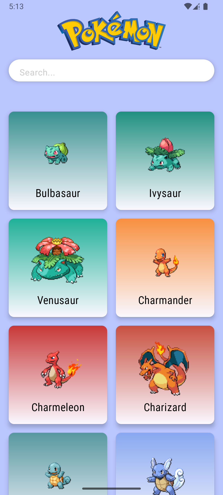
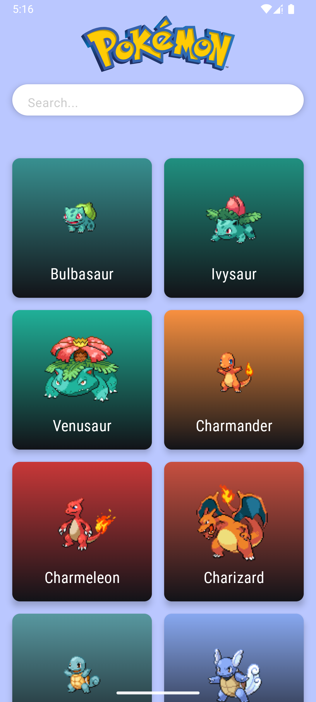
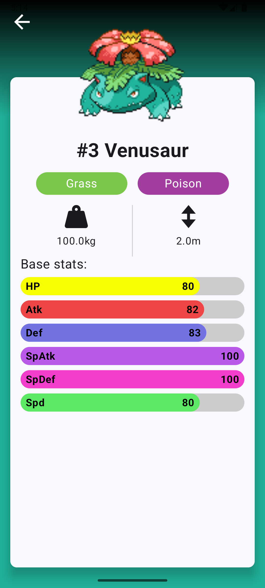
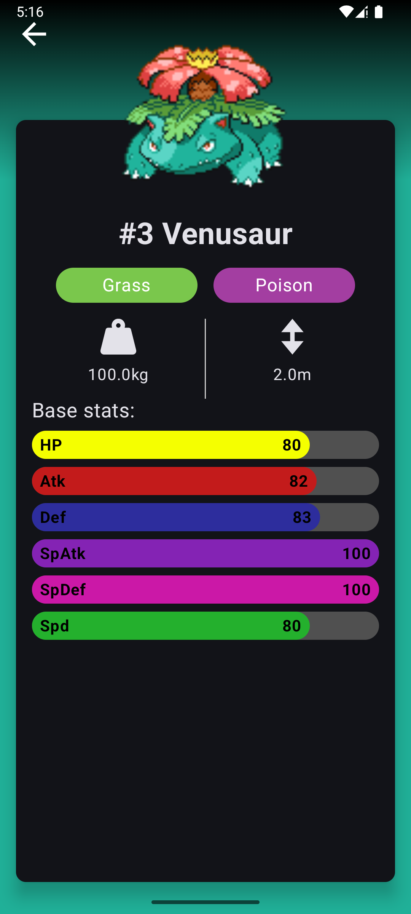

# 📱 Pokédex App

포켓몬 도감 앱은 **안드로이드 최신 기술 스택**을 학습하고 연습하기 위해 제작된 개인 프로젝트입니다.  
주요 목적은 **MVVM 아키텍처**와 **Jetpack Compose UI**, **Hilt DI**, **Retrofit 네트워크 통신**을 실제로 적용하면서  
안드로이드 개발 역량을 확장하는 것입니다.

---

## ✨ 제작 동기
- 포켓몬이라는 친숙한 주제를 활용해 재미있게 연습
- **MVVM 패턴**을 기반으로 클린한 구조 설계 경험
- **Jetpack Compose**로 선언형 UI 학습
- **Hilt**를 활용한 의존성 주입(DI) 적용
- **Retrofit**으로 REST API(PokeAPI) 연동 경험
- **다크 모드 대응**을 통해 사용자 경험(UX) 개선

---

## 🧰 기술 스택
- **언어**: Kotlin
- **UI**: Jetpack Compose, Material3
- **아키텍처**: MVVM, Repository Pattern
- **DI**: Hilt
- **네트워크**: Retrofit + OkHttp
- **이미지 로딩**: Coil
- **비동기 처리**: Coroutines
- **테마**: Light / Dark Mode 지원

---

## 📌 주요 기능
- 포켓몬 리스트 불러오기 (무한 스크롤)
- 포켓몬 상세 화면 (타입, 스탯, 키, 몸무게)
- API 로딩 상태 표시 (로딩/성공/에러)
- 다크 모드/라이트 모드 UI 자동 전환

---

## 📸 Screenshots

| Light Mode | Dark Mode |
|------------|-----------|
|    Home |    Home |
|    Detail |    Detail |

---
